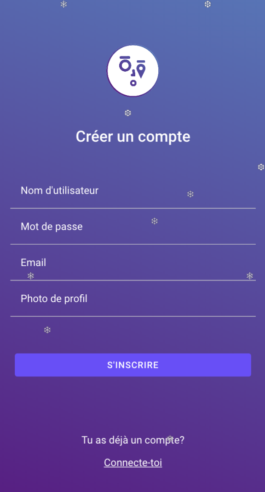
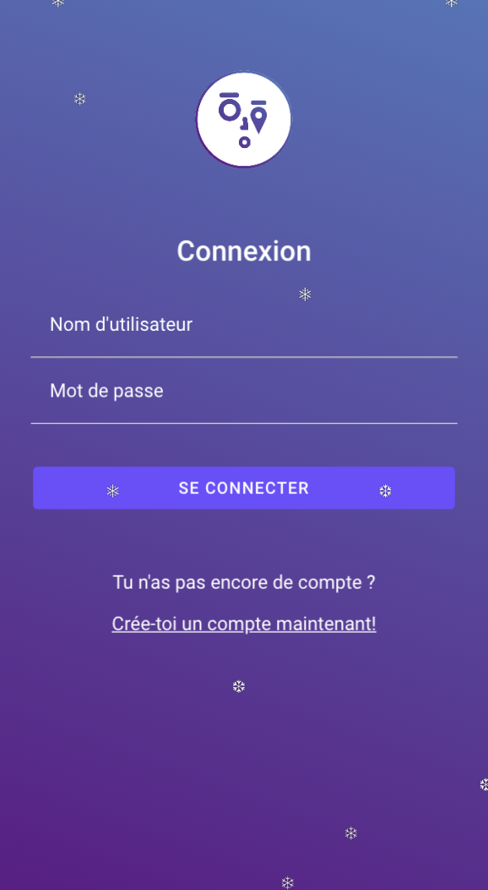
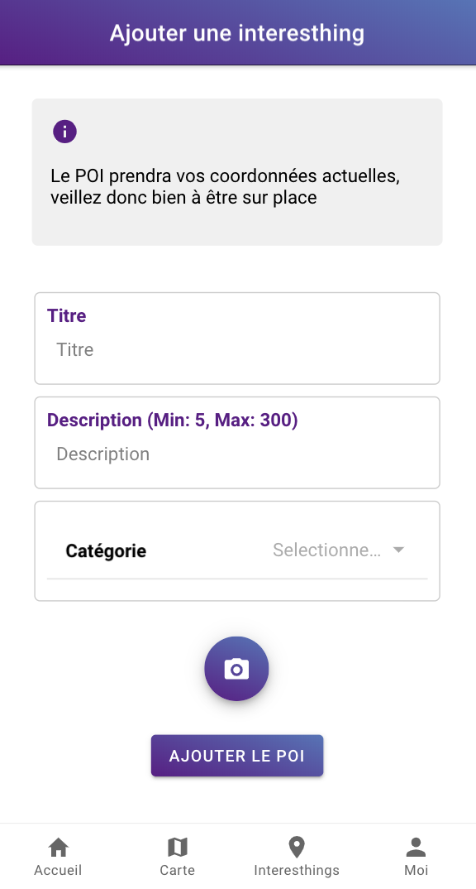

# Interesthing app


## Description

Interesthing is a mobile app implemented with [Angular][angular] on [Ionic][ionic] developped during the DevMob course at HEIG-VD given by [Mathias Oberson][mathias]. The app looks like a new Google Maps. The goal of this app is to show some points of interest in every town in Switzerland (or in the world) like a graffiti (art), a funny place, a WTF?! element, a beautiful spot or still a shortcut.

The app is linked to [Interesthing API][api] (API REST) developped during ArchiOWeb given by [Simon Oulevay][simon].

## Requirements

* [Node.js][node] 12.x

## Usage

To run the application locally on your browser, you can run the following command line. 

```bash
git clone https://github.com/interesthing/ionic-app.git
cd ionic-app
npm install
ionic serve
```

To deploy the application to your phone, you can use Ionic built in tools. See [Ionic documentation][ionic_dev] on testing and deploying the app on a phone. On Android, deploying the application should be as simple as this command line (given that you have Android Studio installed and configured):

```bash
ionic cordova run android
```

## What can you do with the app ?

* **log in** to the app or **create** an account
* **post** some points of interest (POI) with an image
* **see** all of the points of interest (POI) on a map (around me)
* **see** the details of a specific point of interest (POI) and rates this POI
* **filter** the points of interest (POI) by categories and average ratings
* **rate** the other points of interest (POI)
* **see** the insights in real-time on the home page

### Create an account



If you don't have an account you have to create once. You can add an image but it's not implemented and not obligatory. 

### Log in



Now you've an account, you can simply log in the App. 

### Home Page


Websocket is implemented for the real-time component. Insights are refreshed on every post and delete actions for ratings, points of intereste & users.

You can also apply filter directly. 
You can see the POI around you.
The search bar is not implemented for now.
You can also see a top ten of the best POIs. 

### POI page


You can see the details from a POI (image, localisation on a map, description), rates for this POI and see all of the ratings of the POI. 

### Post a POI



You can post a POI. You have to be geolocalised to post a POI.

### User Page


On the user page you can disconnect your account. 
You can update your POIs posted.
You can see all of your ratings posted. 

### See POI around me


On the map section you can see the POI around you and if you're not geolocalised, the POI in Switzerland. 

### Filter by categories


You can filter the POIs by categories or by average ratings. 


[ionic]: https://ionicframework.com/docs
[ionic_dev]: https://ionicframework.com/docs/v1/guide/testing.html
[angular]: https://angular.io/docs
[node]: https://nodejs.org/
[api]: https://interesthing.herokuapp.com/
[mathias]: https://github.com/Tazaf
[simon]: https://github.com/AlphaHydrae
